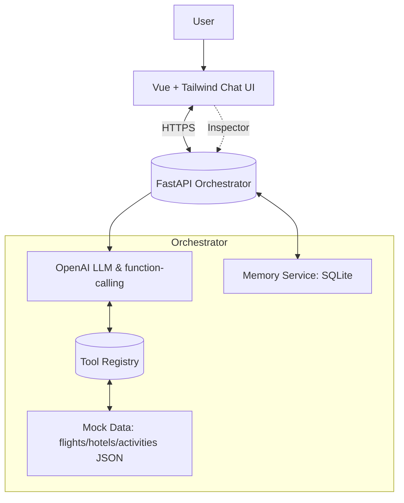

# Travel Agent - Agentic Bot Flow

A conversational travel agent that plans itineraries using an agentic approach with OpenAI function-calling.

## Features

- Natural language trip planning (flights, hotels, activities)
- Multi-step task orchestration
- Conversation memory and user preference tracking
- Real-time action inspection
- BYOK (Bring Your Own Key) support for OpenAI

## Architecture



## Project Structure

```
.
├── backend/          # FastAPI backend
│   ├── app/
│   │   ├── main.py           # FastAPI app
│   │   ├── orchestrator.py   # Agent brain (LLM + tools)
│   │   ├── memory/           # SQLite storage
│   │   ├── tools/            # Flight/hotel/activity search
│   │   └── routes/           # API endpoints
│   └── requirements.txt
├── frontend/         # Vue.js frontend
│   ├── src/
│   │   ├── components/       # ChatView, InspectorView
│   │   └── api.ts            # Backend API client
│   └── package.json
└── README.md
```

## Setup

### Backend

1. Navigate to backend:
```bash
cd backend
```

2. Create virtual environment:
```bash
python -m venv venv
source venv/bin/activate 
```

3. Install dependencies:
```bash
pip install -r requirements.txt
```

4. Create `.env` file with these variables:
```bash
# Create .env file and add:
OPENAI_API_KEY=your_key_here  # Optional: If set, will be used as default. Users can override with their own key.
OPENAI_MODEL=gpt-4.1
CORS_ORIGINS=""  # Set to your frontend URL (in my case https://shrey007.github.io)
```

5. Run server:
```bash
uvicorn app.main:app --reload
```

### Frontend

1. Navigate to frontend:
```bash
cd frontend
```

2. Install dependencies:
```bash
npm install
```

3. Create `.env.local`:
```bash
VITE_API_BASE=http://localhost:8000
```

4. Run dev server:
```bash
npm run dev
```

## Deployment

### Railway (Backend)

1. **Create Railway Account & Project**
   - Go to https://railway.app and sign in with GitHub
   - Click "New Project" → "Deploy from GitHub repo"
   - Select your repository (`shrey007/dev-highlevel` in my case)

2. **Configure Service**
   - Railway will auto-detect the backend
   - Set **Root Directory** to `backend/` in service settings
   - Railway will use `railway.json` for build configuration

3. **Add Environment Variables**
   - Go to your service → Variables tab
   - Add the following:
     ```
     OPENAI_API_KEY=your_openai_api_key_here
     OPENAI_MODEL=gpt-4o-mini
     CORS_ORIGINS=https://shrey007.github.io
     ```
   - **Important**: Replace `CORS_ORIGINS` with your actual GitHub Pages URL after frontend is deployed

4. **Add Volume for Database (Optional, I have not done this due to free tier option.)**
   - Go to service → Volumes tab
   - Add volume mount: `/app/data` → `/data` (or mount at `/app/data`)
   - This ensures SQLite database persists across deployments
   - Database file will be stored at `data/app.db`

5. **Deploy**
   - Railway will automatically deploy on push to `main`
   - Get your backend URL from the service dashboard (e.g., `https://your-app.railway.app`)

### GitHub Pages (Frontend)

1. **Enable GitHub Pages**
   - Go to repository Settings → Pages
   - Source: Select "GitHub Actions" (not "Deploy from a branch")
   - Save

2. **Deploy**
   - Push to `main` branch (workflow auto-runs on frontend changes)
   - Or manually trigger: Actions → "Deploy Frontend to GitHub Pages" → Run workflow
   - Wait for deployment to complete
   - Your site will be at: `https://shrey007.github.io/dev-highlevel`

3. **Update CORS_ORIGINS in Railway**
   - After frontend is deployed, update Railway env var:
     ```
     CORS_ORIGINS=https://shrey007.github.io
     ```
   - Redeploy backend if needed

### Post-Deployment Configuration

1. **Update Frontend API URL** (if not using secret):
   - Edit `.github/workflows/deploy-frontend.yml`
   - Update `VITE_API_BASE` in the build step

2. **Verify CORS**
   - Check browser console for CORS errors
   - Ensure Railway `CORS_ORIGINS` matches your GitHub Pages URL exactly

## Usage

1. Open the frontend URL
2. (Optional) Enter your OpenAI API key in the field - if left empty, server key will be used
3. If server key expires/hits limit, you'll be prompted to enter your own key
4. Start chatting to plan your trip
5. View actions and memory updates in the Inspector panel

**API Key Mode:**
- **Dual Mode**: If you enter a key, it will be used. If left empty, server's default key is used.
- **Auto-fallback**: If server key fails (rate limit/quota), you'll be prompted to enter your own key.

## Tech Stack

- Backend: FastAPI, Python, SQLite, OpenAI API
- Frontend: Vue.js, TailwindCSS, Vite
- Hosting: Railway (backend), GitHub Pages (frontend)
