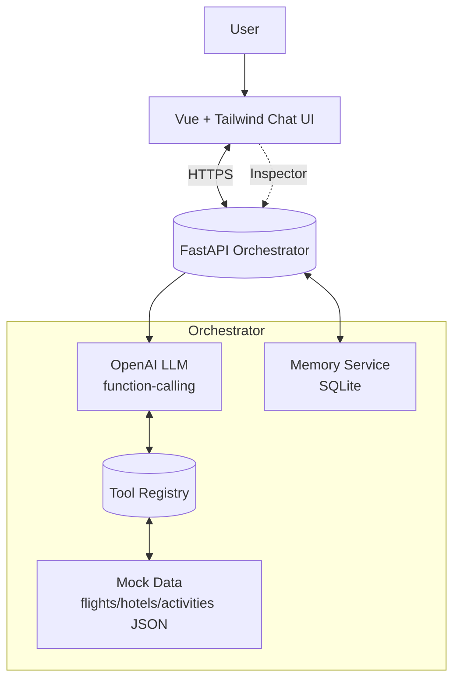

# Travel Agent - Agentic Bot Flow

A conversational travel agent that plans itineraries using an agentic approach with OpenAI function-calling.

## Features

- Natural language trip planning (flights, hotels, activities)
- Multi-step task orchestration
- Conversation memory and user preference tracking
- Real-time action inspection
- BYOK (Bring Your Own Key) support for OpenAI

## Architecture



## Project Structure

```
.
├── backend/          # FastAPI backend
├── frontend/         # Vue.js frontend
├── docs/            # Documentation
└── README.md
```

## Setup

### Backend

1. Navigate to backend:
```bash
cd backend
```

2. Create virtual environment:
```bash
python -m venv venv
source venv/bin/activate  # On Windows: venv\Scripts\activate
```

3. Install dependencies:
```bash
pip install -r requirements.txt
```

4. Create `.env` file with these variables:
```bash
# Create .env file and add:
OPENAI_API_KEY=your_key_here  # Optional: If set, will be used as default. Users can override with their own key.
ALLOW_CLIENT_KEYS=true
MEMORY_BACKEND=sqlite
SQLITE_PATH=data/app.db
OPENAI_MODEL=gpt-4o-mini
CORS_ORIGINS=http://localhost:5173
```

5. Run server:
```bash
uvicorn app.main:app --reload
```

### Frontend

1. Navigate to frontend:
```bash
cd frontend
```

2. Install dependencies:
```bash
npm install
```

3. Create `.env.local`:
```bash
VITE_API_BASE=http://localhost:8000
```

4. Run dev server:
```bash
npm run dev
```

## Deployment

### Railway (Backend)

1. Connect GitHub repo to Railway
2. Set root directory to `backend/`
3. Add environment variables (see `.env.example`)
4. Add volume mount at `/data` for SQLite persistence
5. Deploy

### GitHub Pages (Frontend)

1. Build frontend:
```bash
cd frontend
npm run build
```

2. Deploy `dist/` folder to GitHub Pages

## Usage

1. Open the frontend URL
2. (Optional) Enter your OpenAI API key in the field - if left empty, server key will be used
3. If server key expires/hits limit, you'll be prompted to enter your own key
4. Start chatting to plan your trip
5. View actions and memory updates in the Inspector panel

**API Key Mode:**
- **Dual Mode**: If you enter a key, it will be used. If left empty, server's default key is used.
- **Auto-fallback**: If server key fails (rate limit/quota), you'll be prompted to enter your own key.

## Tech Stack

- Backend: FastAPI, Python, SQLite, OpenAI API
- Frontend: Vue.js, TailwindCSS, Vite
- Hosting: Railway (backend), GitHub Pages (frontend)

